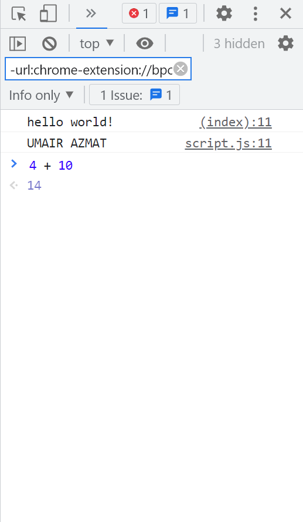

# Beginner's-challenge's

1- Open your code editor and create an HTML file.  
2- Within the HTML file, set up the HTML tags, doctype, head, and body.  
3- Add the script tags to the body of the HTML file.  
4- Within the script tags, place the following JavaScript code: console.log("hello world!").  
5- Link an external JavaScript file (script.js) to the HTML file using a script tag with the src attribute.  
6- Open the browser console and type 4 + 10. What do you see as the response?  
7- Use the console.log() syntax to log values to the console. Try entering your name within quotes.  

